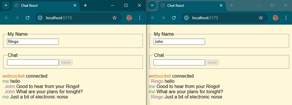

# websocket-chat

Example of using WebSocket to create a simple peer chat program.

To use the example you must already have Node.js installed.

1. Clone this repository to your development environment.
1. Open a console window and execute the following:
        ```sh
        (cd service && npm install)
        npm install
        ```
1. Start the backend in VS Code
    1. Open the project in VS Code
    1. Open the `service/service.js` file. 
    1. Press `F5` to start debugging. Choose Node.js as the debugging target.
1. Start the backend running from a console window
    1. Change directory into the project root.
    1. Run `npm run dev`.
1. Use websocket chat
    1. Open two web browser windows to `http://localhost:5173`.
    1. Start using the chat interface to send messages between the windows.


